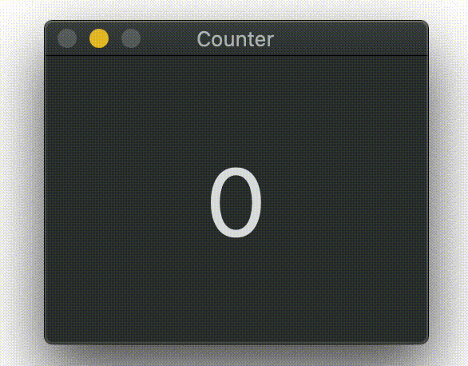

# Counter
# A tiny macOS app that keeps a tally count

Left click to increment, right click to decrement.

Up and down keys are alternatives to clicking. Left and right keys do 5 at a time. 0 key zeros the count.

Count is always displayed in the Dock.

Count can be modified without switching to the app.

## Get it

View [releases on GitHub](https://github.com/ThatsJustCheesy/Counter/releases).
